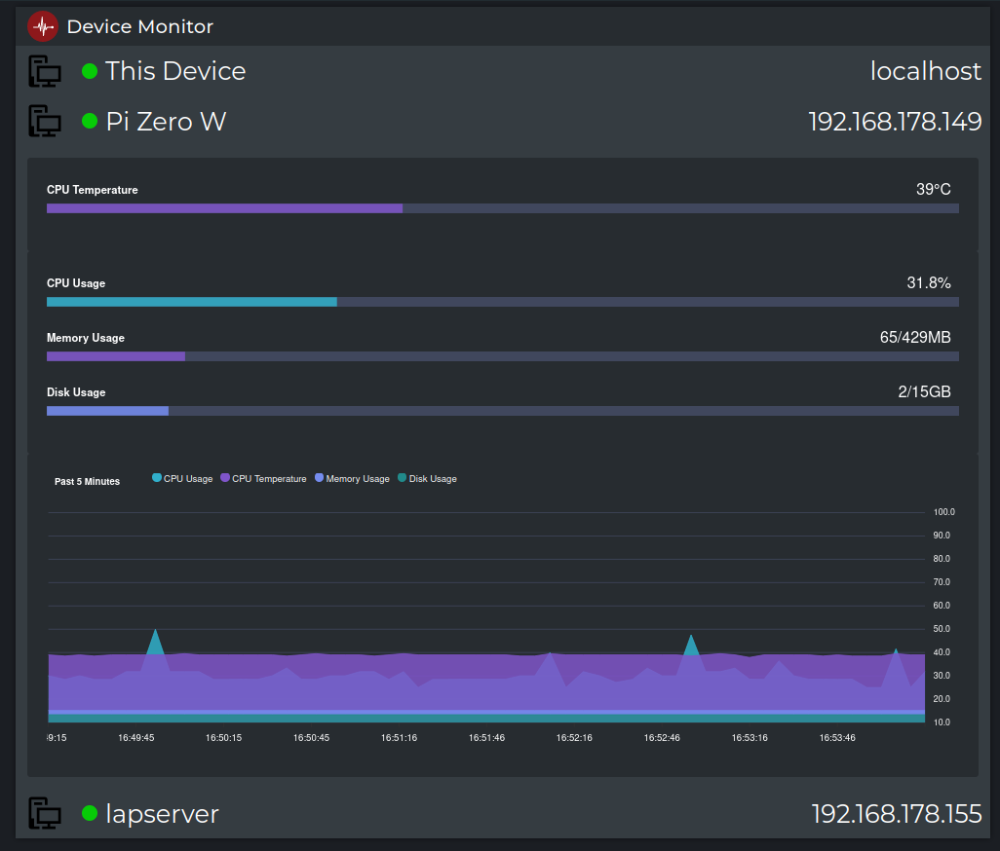

# Device Stats Web Interface

This simple API allows you to monitor the health and status of your Linux systems by providing essential metrics such as
CPU temperature, usage, memory, and disk utilization.
It integrates with the [Minimal Device Stats](https://github.com/Finnomator/MinimalDeviceStats) tool to extend its capabilities.



## Installation

1. Clone the production branch of this repository
    ```sh
    git clone -b production https://github.com/Finnomator/DeviceStats.git
    cd DeviceStats
    ```
2. Install the required python modules in `requirements.txt`
   ```sh
   pip install -r requirements.txt
   ```
3. Start the server
   ```sh
   ./start_server.sh
   ```

### Add Network Devices

1. Install [Minimal Device Stats](https://github.com/Finnomator/MinimalDeviceStats) on every machine you would like to
   monitor with the web interface.
2. Add the device to `DEVICE_IPS` in `secrets.py`. The key specifies the name displayed in the interface and the value
   is the ip address of the device.
3. Restart the server

## Usage

### Web Interface

Open a browser and go to [http://127.0.0.1:8923/](http://127.0.0.1:8923/).
You should see a website that shows the devices you configured in `secrets.py`.  
It shows whether the server is on- or offline, its ip, cpu usage, cpu temperature, memory and disk usage.  
Click on a device to expand.

### API

Make a GET request to `http://127.0.0.1:8923/sysinfo`.

## API Responses

### /

Format: HTML

Web interface. Access with a browser.

### /sysinfo

Format: JSON

| Key          | Unit     | Type  | Description                                                                                                                                                                                                                                                                      |
|--------------|----------|-------|----------------------------------------------------------------------------------------------------------------------------------------------------------------------------------------------------------------------------------------------------------------------------------|
| cpu_temp     | °C       | float | Cpu temperature.                                                                                                                                                                                                                                                                 |
| cpu_usage    | %        | float | Represents the current system-wide CPU utilization as a percentage.                                                                                                                                                                                                              |
| total_memory | Megabyte | int   | Total physical memory available.                                                                                                                                                                                                                                                 |
| used_memory  | Megabyte | int   | Memory used, calculated differently depending on the platform and designed for informational purposes only: <br/>- macOS: active + wired <br/>- BSD: active + wired + cached <br/>- Linux: total - free (free = memory not being used at all (zeroed) that is readily available) |
| total_disk   | Gigabyte | int   | Total disk size of `/`.                                                                                                                                                                                                                                                          |
| used_disk    | Gigabyte | int   | Used disk size.                                                                                                                                                                                                                                                                  |

Example Response:

```json
{
  "cpu_temp": 39.0,
  "cpu_usage": 28.6,
  "total_memory": 429,
  "used_memory": 63,
  "total_disk": 15,
  "used_disk": 2
}
```

## Notes

- Ensure the server is running and accessible from your network.
- Modify the start_server.sh script if you need to change the default port or other configurations.